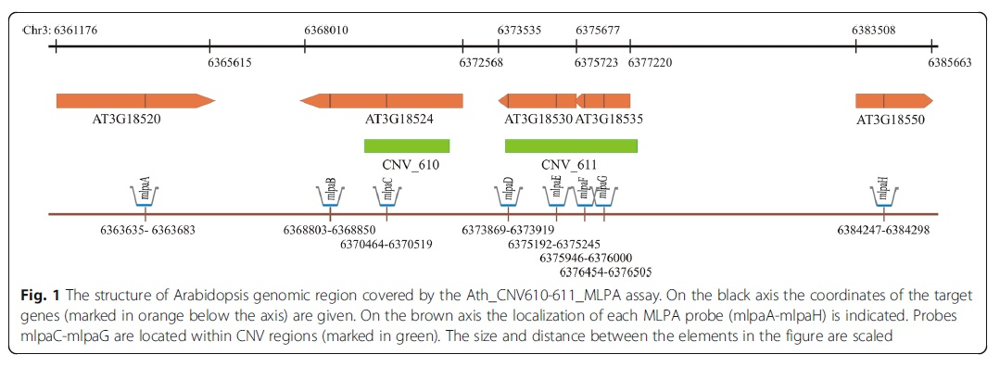

mapa regionów podatnych na niealleliczną rekombinację alleliczną u Arabidopsis thaliana

****1. przygotowanie danych  
PrepareTestData.py
Wycięcie znanego CNV wraz z rejonem flankującym na podstawie Zmienko et al. BMC Genomics (2016) 17:893

fragment - Chr3:6'300'000-6'400'000

